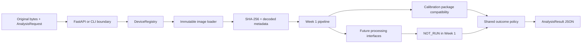

# KERASCAN architecture

Week 1 separates the input boundary, device configuration, orchestration and
outcome policy. The processing seams are typed now, but no unimplemented stage
pretends to have run.

`AnalysisRequest`, `DeviceConfiguration`, `ApplicationConfiguration`,
`CalibrationManifest`, `DatasetManifest` and `AnalysisResult` are Pydantic
models. Their JSON schemas are generated artifacts. The request and result use
the same metadata names: `anonymous_patient_id`, `eye`,
`capture_session_id`, `device_version`, `operator_id` and
`capture_timestamp`. `eye` is `OD` or `OS`, and capture timestamps without a
timezone are rejected.

The API writes an upload to a server-generated file inside a temporary
directory. The uploaded filename is used only as a possible format hint; it is
never used as a filesystem path. The loader reads the original bytes, hashes
those exact bytes, checks the extension and magic signature, decodes an in
memory copy with OpenCV and returns a read-only NumPy array. Week 1 preserves
the camera pixel orientation and records `orientation_transformation: "none"`.
The source file is never overwritten, sharpened or enhanced. The temporary
file and directory are removed on success and errors.

The device fingerprint includes `device_version` and the `physical` section
of the device configuration. It excludes runtime upload limits, storage
locations and application/UI preferences. A calibration package records the
fingerprint in its manifest and companion files. A mismatch makes the package
`INVALID`; missing measurements leave the package `UNVALIDATED`.

For a valid Week 1 capture, input validation, device validation and image
loading can be `PASSED`. Calibration validation is `FAILED` when the package
is missing, invalid or unvalidated. Quality assessment, centre detection,
segmentation, ring tracking and feature extraction are `NOT_RUN` with
`STAGE_NOT_IMPLEMENTED`. If a prerequisite fails, downstream stages may be
`BLOCKED`. The outcome policy is implemented and always returns `MANUAL_REVIEW`
in mock mode.

The result keeps unavailable values as `null`, includes a validity/status field
for each measurement group and has an empty artifact list because uploads are
not retained. Pydantic rejects non-finite floats and `AnalysisResult.to_json()`
uses strict JSON serialization. Future internal numerical samples may use
`NaN` while being processed, but they must be converted to JSON `null` together
with validity information before they cross this contract.

`referral/policy.py` is the only Week 1 outcome policy. The
`allow_screen_negative` configuration flag cannot bypass mock mode, missing or
unvalidated calibration, failed stages or the required future processing
stages. No Week 1 path emits `SCREEN_NEGATIVE` or a referral recommendation.

The core package has no Streamlit import. A future UI should call the API or
`AnalysisService`, use the generated schemas, and display `null` values as
unavailable rather than zero.
