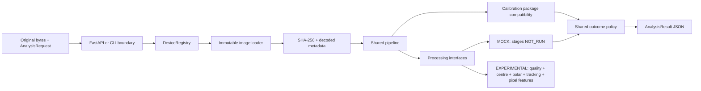

# KERASCAN architecture

The pipeline separates the input boundary, device configuration, image-space
processing, artifact rendering and outcome policy. `MOCK` remains the default;
`EXPERIMENTAL` runs the explicit non-diagnostic engineering stages.

```mermaid
flowchart LR
    A[Original bytes + AnalysisRequest] --> B[FastAPI or CLI boundary]
    B --> C[DeviceRegistry]
    C --> D[Immutable image loader]
    D --> E[SHA-256 + decoded metadata]
    E --> F[Shared pipeline]
    F --> G[Calibration package compatibility]
    F --> H[Processing interfaces]
    H --> I[MOCK: stages NOT_RUN]
    H --> X[EXPERIMENTAL: quality + centre + polar + tracking + pixel features]
    G --> J[Shared outcome policy]
    I --> J
    J --> K[AnalysisResult JSON]
```

`AnalysisRequest`, `DeviceConfiguration`, `ApplicationConfiguration`,
`CalibrationManifest`, `DatasetManifest` and `AnalysisResult` are Pydantic
models. Their JSON schemas are generated artifacts. The request and result use
the same metadata names: `anonymous_patient_id`, `eye`,
`capture_session_id`, `device_version`, `operator_id` and
`capture_timestamp`. `eye` is `OD` or `OS`, and capture timestamps without a
timezone are rejected.

The API writes an upload to a server-generated file inside a temporary
directory. The uploaded filename is used only as a possible format hint; it is
never used as a filesystem path. The loader reads the original bytes, hashes
those exact bytes, checks the extension and magic signature, decodes an in
memory copy with OpenCV and returns a read-only NumPy array. The pipeline preserves
the camera pixel orientation and records `orientation_transformation: "none"`.
The source file is never overwritten, sharpened or enhanced. The temporary
file and directory are removed on success and errors.

The device fingerprint includes `device_version` and the `physical` section
of the device configuration. It excludes runtime upload limits, storage
locations and application/UI preferences. A calibration package records the
fingerprint in its manifest and companion files. A mismatch makes the package
`INVALID`; missing measurements leave the package `UNVALIDATED`.

In mock mode, quality assessment, centre detection, polar sampling, ring
tracking and feature extraction are `NOT_RUN`. Experimental mode records each
stage that ran; if centre detection fails, polar sampling and all dependent
stages are `BLOCKED`. A valid calibration is not required for image-space
measurements, but the calibration status remains visible and pixel values are
never described as physical measurements.

The result keeps unavailable values as `null`, includes status and validity
fields for measurement groups, records stage execution and serializes missing
ring samples as `null` with a matching false validity mask. Pydantic rejects
non-finite floats and `AnalysisResult.to_json()` uses strict JSON serialization.
The artifact list is empty by default. An explicit `include_overlays=true` API
query returns display-only base64 PNGs in the same result contract with
`retained: false`; it does not save them to disk.

`referral/policy.py` remains the only mock outcome policy. Both modes return
`MANUAL_REVIEW`. The experimental pipeline does not emit `SCREEN_NEGATIVE` or
`PENTACAM_EVALUATION_RECOMMENDED`, and it does not infer physical or clinical
measurements from pixels.

The core package has no Streamlit import. The optional Streamlit interface calls
the local API, uses the shared contracts, and displays `null` values as
unavailable rather than zero. See
[experimental_pipeline.md](experimental_pipeline.md) for measurements,
function interfaces and synthetic acceptance cases.
